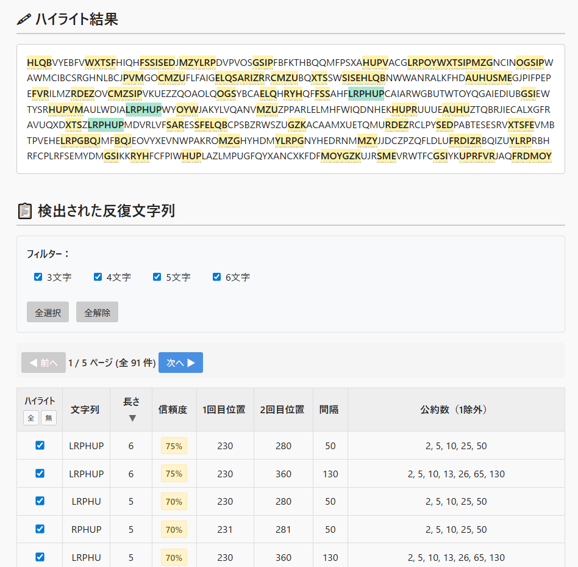

# RepeatSeq Analyzer - 反復文字列の特定ツール


**Day028 - 生成AIで作るセキュリティツール100**

**RepeatSeq Analyzer** は、暗号文中に繰り返し出現する文字列（3文字以上）を検出するツールです。
反復文字列（繰り返し文字列）の位置や間隔から暗号の鍵長を推定を支援します。

とくに古典暗号の解読訓練や、カシスキー法の理解促進に役立ちます。

---

## 🔍 デモページ

👉 [https://ipusiron.github.io/repeatseq-analyzer/](https://ipusiron.github.io/repeatseq-analyzer/)

---

## 📸 スクリーンショット

>
>
>*ダミー*

---

## 🎯 主な機能

- 3文字以上の反復文字列を自動検出
- 最初の出現位置・再出現位置・間隔の算出
- 間隔の公約数を計算し、鍵長の候補を提示
- 暗号文中における該当文字列をビジュアルにハイライト表示
- 長さ5文字以上の繰り返しを強調

---

## 📚 活用例

- 古典暗号（ヴィジュネル暗号など）の **鍵長推定**
- **カシスキー法（Kasiski Examination）** の可視化体験
- 教育・講義用の補助ツール
- 暗号文の周期性パターンの探索

---

## 🧪 使い方

1. 暗号文をテキストエリアに貼り付けます（英大文字推奨）
2. 「空白・記号を除去」にチェック（初期状態でON）
3. 「解析する」ボタンを押すと、以下が表示されます：
   - ハイライトされた反復箇所
   - 検出結果のテーブル（文字列・位置・間隔など）
   - 推定される鍵長候補（公約数に基づく）

---

## 🛠 技術的ポイント

- HTML / CSS / Vanilla JavaScriptによる構成
- 正規表現とスライドウィンドウによる部分文字列抽出
- 公約数算出による周期的鍵候補の提示
- 今後の機能拡張として：
  - 検出の多重対応（3回以上）
  - 色分けの自動分類
  - ソート機能の追加

---

## 📂 フォルダー構成

```
repeatseq-analyzer/
├── index.html
├── style.css
├── script.js
└── README.md
```

---

## 実験

手元にある暗号文から、以下の情報を特定するのがゴールです。

- 暗号化の種類
- 鍵
- 鍵長
- 平文（復号結果）

### 活用するツール

- [Vigenere Cipher Tool](https://ipusiron.github.io/vigenere-cipher-tool/)
- [Caesar Cipher Wheel Tool](https://github.com/ipusiron/caesar-cipher-wheel)

### サンプル1


### サンプル2


### サンプル3

### サンプル4

---

## 📄 ライセンス

MIT License - 詳細は[LICENSE](LICENSE)をご覧ください。

---

## 🛠 このツールについて

本ツールは、「生成AIで作るセキュリティツール100」プロジェクトの一環として開発されました。
このプロジェクトでは、AIの支援を活用しながら、セキュリティに関連するさまざまなツールを100日間にわたり制作・公開していく取り組みを行っています。

プロジェクトの詳細や他のツールについては、以下のページをご覧ください。

🔗 [https://akademeia.info/?page_id=42163](https://akademeia.info/?page_id=42163)
