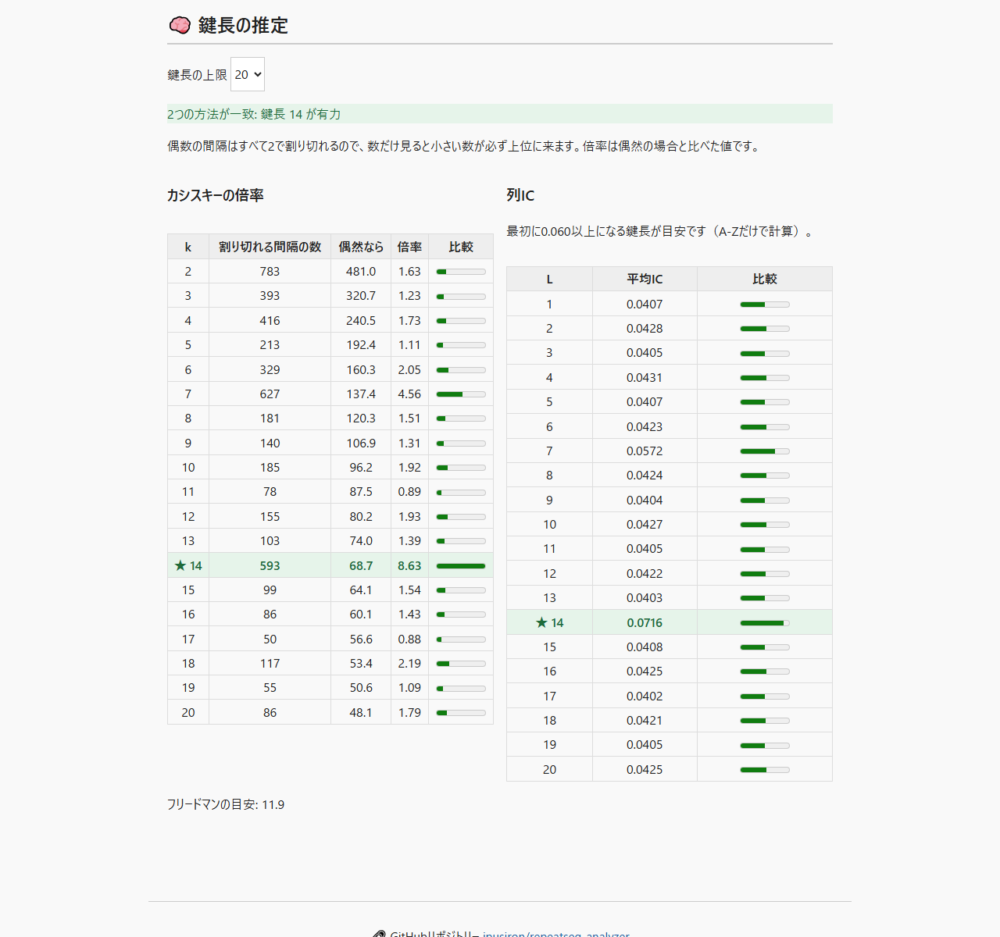
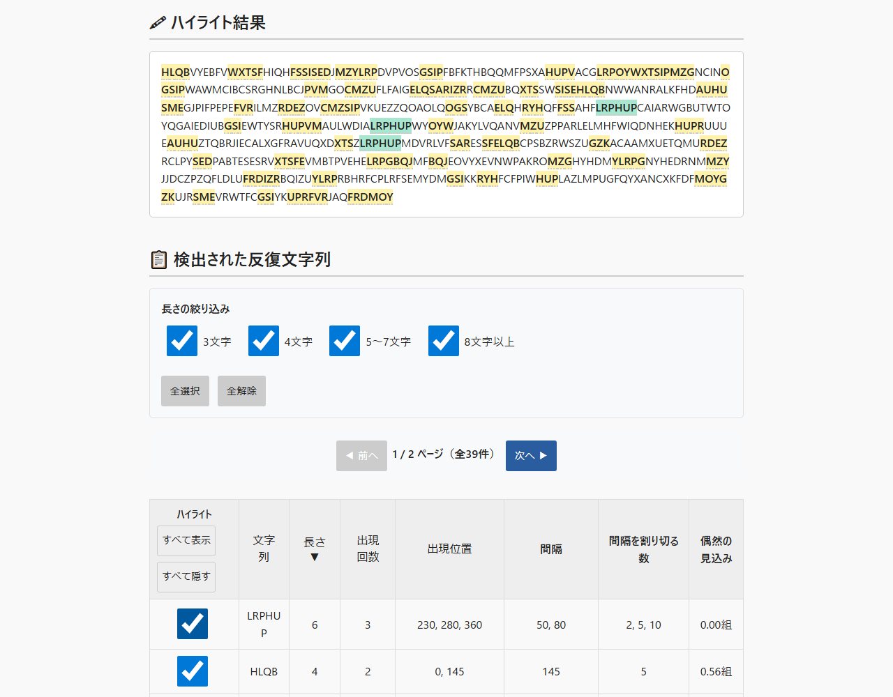
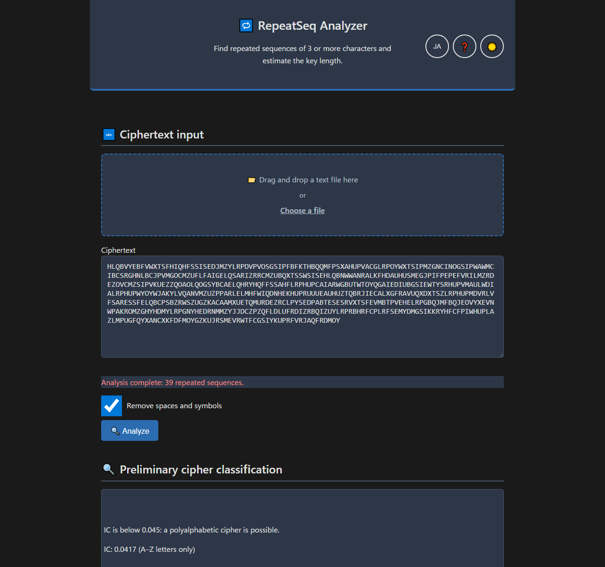
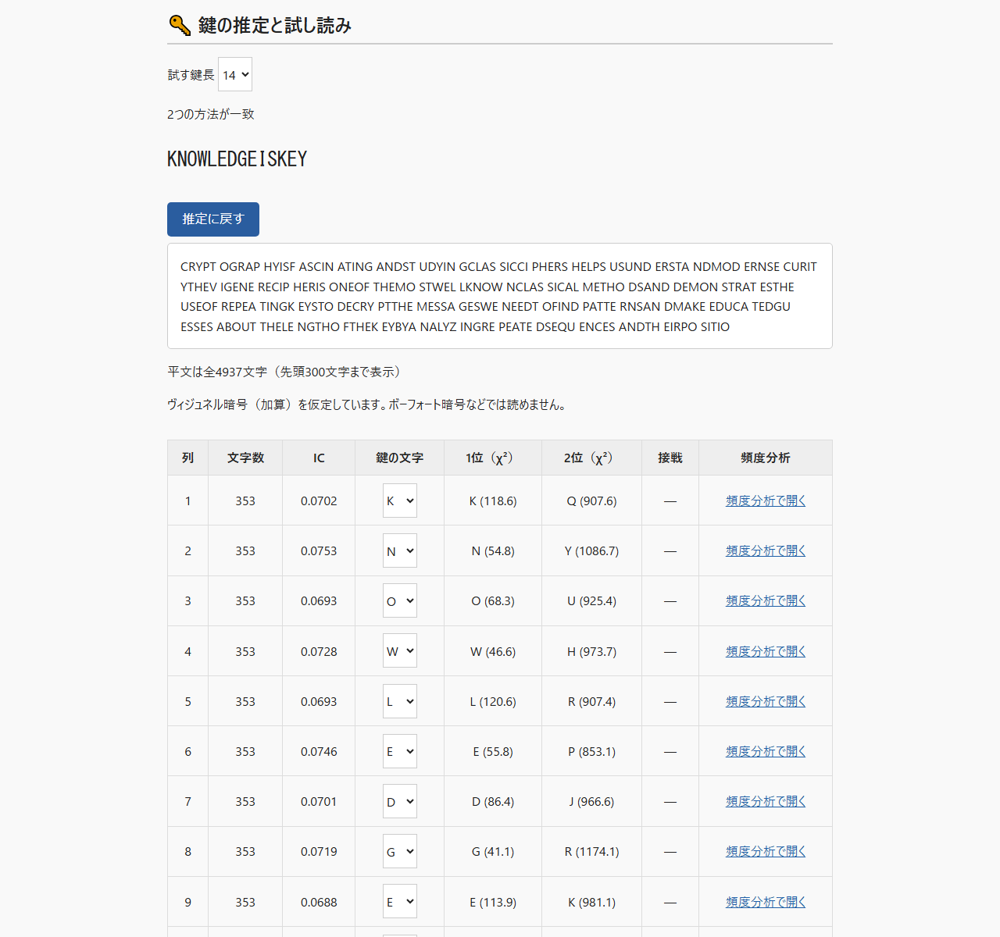
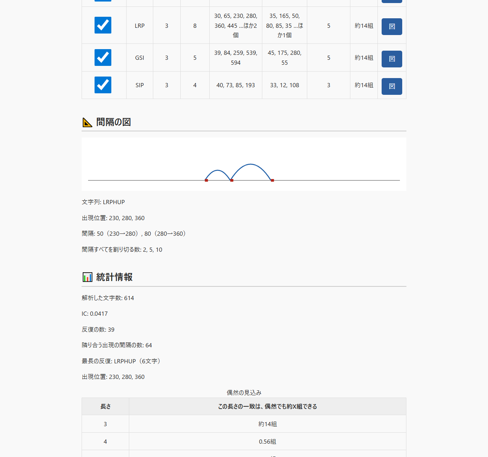

<!--
---
id: day028
slug: repeatseq-analyzer

title: "RepeatSeq Analyzer"

subtitle_ja: "反復文字列の特定ツール"
subtitle_en: "Repeated Sequence Detection Tool"

description_ja: "暗号文の極大反復を検出し、カシスキーの倍率と列ICから鍵長を推定するクライアントサイド暗号解析ツール"
description_en: "Client-side cryptanalysis tool that detects maximal repeats and estimates key length with Kasiski ratios and column IC"

category_ja:
  - 暗号解読
  - 古典暗号
category_en:
  - Cryptanalysis
  - Classical Cryptography

difficulty: 4

tags:
  - kasiski
  - vigenere
  - cryptanalysis
  - pattern-detection
  - key-length

repo_url: "https://github.com/ipusiron/repeatseq-analyzer"
demo_url: "https://ipusiron.github.io/repeatseq-analyzer/"

hub: true
---
-->

English: [README.en.md](README.en.md)

# RepeatSeq Analyzer - 反復文字列の特定ツール


[](https://ipusiron.github.io/repeatseq-analyzer/)

**Day028 - 生成AIで作るセキュリティツール100**

RepeatSeq Analyzerは、暗号文中に繰り返し出現する文字列（3文字以上）を検出し、その位置や間隔から暗号の鍵長の推定を支援するツールです。
古典暗号の解読訓練やカシスキー法の学習に向けて、極大反復・カシスキーの倍率・列ICをブラウザー内で計算します。

## 🌐 デモページ

[RepeatSeq Analyzerを開く](https://ipusiron.github.io/repeatseq-analyzer/)

## 📸 スクリーンショット


> *vigenere2を解析したライト・日本語の画面。カシスキーの倍率8.63と列ICが鍵長14で一致。1280×1200、105,650バイト。*


> *vigenere1のLRPHUP（長さ6、位置230・280・360）とハイライト。1280×1200、127,823バイト。*


> *vigenere1を画面から読み込んだ英語・ダークの入力節。本文色の完了案内と事前判定。1280×1000、81,885バイト。*


> *vigenere2の推定鍵KNOWLEDGEISKEY、列の候補と試し読み。1280×1200、106,893バイト。*


> *vigenere1のLRPHUP、帯3つ・弧2本と間隔50・80、公約数2・5・10。1280×1200、68,042バイト。*

## ✨ 機能

- 同梱サンプル5つの読み込み、解析結果に連動する5段の解読ガイド
- 選んだ反復の出現位置・隣接間隔・公約数を示すSVG図
- 列ごとのカイ二乗による鍵推定、鍵文字の手修正と試し読み、Day009への列の受け渡し

- 3文字以上の極大反復の検出と全出現位置・隣接間隔の表示
- A-ZだけのICによる暗号種別の事前判定
- カシスキーの倍率・列IC・フリードマンによる鍵長の推定
- 各反復と長さ3〜6の偶然の見込み
- 黄（3〜4文字）・緑（5〜7文字）・赤（8文字以上）のハイライト、重なる位置では長い区分を優先
- 行ごとのハイライト、すべて表示・すべて隠す
- 20件ずつのページ送り、4列の並べ替え、4区分の長さフィルター
- テキストファイルの選択とドラッグ&ドロップ
- 日英切り替え、ライト／ダーク、キーボード操作、説明ダイアログ

## 📖 使い方

同梱サンプルを選んで「読み込む」を押すと、空白・記号の除去をオンにして解析します。選択肢は種別だけで鍵を示しません。
「解読の手順」の「ここへ」は対応する見出しへ移動し、フォーカスを移します。解析前は2〜5段が無効です。
表の「図」で間隔図を切り替えます。既定は最長の反復です。並べ替え・絞り込み・ページ送りでは選択を保持します。
出現位置は20個まで、弧は12本までで、残りの数を添えます。間隔と公約数は文字でも表示します。
「鍵の推定と試し読み」で各列の鍵文字を変更できます。「推定に戻す」で全列を戻します。
試し読みはA-Zだけの平文の先頭300文字を5文字区切りで表示し、全文の文字数も添えます。
鍵長の変更は手修正を破棄します。言語切り替えでは鍵長・手修正・図の選択を保持します。

### 基本的な使用手順

1. 暗号文を入力欄へ貼り付けるか、テキストファイルを選択・ドロップする。
2. 「空白・記号を除去して処理」と鍵長の上限（20／30／40、既定20）を確認する。
3. 「🔍 解析する」を押す。ファイル読み込みでは自動で解析する。
4. 事前判定・ハイライト・反復の表・統計・鍵長の推定を順に確認する。

解析対象は10,000文字まで、ファイルは.txtまたはtext/*形式で1MB以下です。
入力はNFKDで正規化し、結合文字を除いて大文字にします。空白・記号の除去は初期状態でオンです。
オフにすると空白・改行・記号も位置や反復の対象に残りますが、列IC・フリードマン・事前判定は常にA-Zだけで計算します。

入力・記号の設定・上限を変えると、古い結果を隠します。再度解析してください。
言語の切り替えは解析をやり直さず、同じ結果を描き直します。
表の文字列は24文字、位置と間隔は6個までを表示し、残りの件数を添えます。
出現位置は0から数えます。文字列・長さ・出現回数・最初の位置で並べ替えられます。

## ❓ なぜ反復文字列を特定するのか

多表式暗号（とくにヴィジュネル暗号）では、同じ鍵長で暗号化された場合、同じ平文部分が同じ暗号文として再現されることがあります。  
この性質により、同じ文字列が暗号文内で繰り返される（反復文字列）現象が起きます。

反復文字列の間隔を分析し、その公約数を求めることで、鍵長の候補を絞り込むことができます。

こうした一連の手法を、カシスキー（Kasiski）法といいます。

### 具体例

たとえば、ヴィジュネル暗号文の中に、同一文字列が見つかり、その間隔が30文字だったとします。
そのとき、30の約数である1, 2, 3, 5, 6, 10, 15, 30が鍵長の候補になります。

鍵長1は単一換字の可能性として列ICで扱います。カシスキーの表は2から選択した上限までの約数を対象にします。

さらに、別の反復文字列があれば、さらに候補を絞り込める可能性が高まります。
なぜなら、どちらの約数にも登場するような数字こそが、新たな鍵長の候補になるからです。


## 🔬 解析の方法と既知解答

### 極大反復と偶然の見込み

極大反復は、左右に伸ばせない出現の組を持つ長さ3以上の文字列です。
全出現位置を重なりも含めて昇順に並べ、隣り合う位置の差を間隔とします。
長い反復の部分列は、別の文脈を持つ場合だけ別の行になります。
既定の順序は長さの降順、同じ長さなら最初の位置の昇順です。

偶然の見込みは`C(n−L+1, 2) × κ^L`です。nは解析した文字列の長さ、Lは一致の長さ、κはその文字列のICです。
この長さの一致が、偶然でも約何組できるかを示します。1以上は整数、1未満は小数2桁に丸めるので、0.00組は必ずしも確率ゼロを意味しません。

### 鍵長の推定

カシスキーの倍率は`kで割り切れる間隔の数 ÷（全間隔の数 ÷ k）`です。
偶数の間隔はすべて2で割り切れるため、数だけでは小さい数が上位になりやすく、倍率で偶然の場合と比較します。
最大倍率のkの約数（k自身を含む）のうち、最大の0.8倍以上の倍率を持つ最小のものを推定値とします。
最大倍率が2.5未満なら、はっきりした偏りなし（null）です。

列ICは鍵長ごとに列へ分けたICの平均です。1から上限まで調べ、最初に0.060以上になる長さを選びます。
1なら単一換字の可能性があります。両方式が同じ値を示すと強い根拠になりますが、正解を保証するものではありません。

フリードマンの目安は`(κp−κr)n / ((κp−I)+n(I−κr))`です。
英語のκp=0.065、一様分布のκr=1/26を使います。2文字未満や分母が0以下ならnull、1未満は1とします。
画面は小数1桁、下表は小数2桁です。英語と統計が異なる文や短文では慎重な判断が必要です。

事前判定は100文字未満をデータ不足、IC>0.060を単一換字、IC<0.045を多表式またはランダムに近い文字列、その間を判定困難とします。
同じ文字の連続などでは、候補の文字数の合計200万または出現位置の合計20万で打ち切り、警告を表示します。

### 鍵の推定と試し読み

A-Zだけの暗号文を鍵長Lの列へ分け、各列の26通りのシフトを英文の文字頻度と比較します。
カイ二乗は`χ² = Σ (観測数 − 期待数)² / 期待数`です。期待数は列の文字数×英文の頻度です。
Day009 Frequency Analyzerと同じLewandの26文字の頻度（合計99.999%）を使い、最小のシフトを鍵文字とします。同点ならAに近い文字です。
2位のχ²が1位の1.5倍未満なら「接戦」です。1位が0なら接戦にはしません。
ヴィジュネル暗号（加算）を仮定しており、ボーフォート暗号などでは読めません。
既定の鍵長は、列ICが1なら1、2方式が一致すればその値、一方が他方の倍数なら小さいほうです。
それ以外の食い違いはカシスキー、片方だけならその値、両方nullなら1から試します。

| サンプル | 既定の鍵長 | 推定鍵 | 試し読みの先頭30文字 |
|---|---|---|---|
| caesar | 1 | D | WHENINAPRILTHESWEETSHOWERSFALL |
| shift | 1 | Q | WHENINAPRILTHESWEETSHOWERSFALL |
| vigenere1 | 5 | LEMON | WHENINAPRILTHESWEETSHOWERSFALL |
| vigenere2 | 14 | KNOWLEDGEISKEY | CRYPTOGRAPHYISFASCINATINGANDST |
| random | —（1で試す） | Q | OGDSTCDUOYUWUYZFYNHZYGYBAQUHHV |

### 短い暗号文での外れ方

vigenere1の先頭150文字ではカシスキーが20、列ICが5で、倍数の関係から既定は5です。
推定鍵はLEIONになり、3列目の1位I（44.9）と2位M（63.6）が接戦です。Mに直すと読めます。
200文字ではLEMONになります。以下はA-Zだけの先頭を使った比較です。

| 文字数 | カシスキー | 列IC | 既定 | 推定鍵 | 接戦の列 |
|---|---|---|---|---|---|
| 100 | 15 | 5 | 5 | LEION | 3 |
| 150 | 20 | 5 | 5 | LEION | 3 |
| 200 | 20 | 5 | 5 | LEMON | — |

### 旧版からの変更点

長さ3〜25の窓をすべて数える方法から極大反復に変更しました。
鍵長は約数の単純な合計ではなく倍率と列ICで推定し、根拠のない百分率の点数を偶然の見込みへ置き換えました。

### 同梱サンプルの既知解答

| サンプル | ファイル | 種別 | 鍵 | 文字数 | 反復の数 | カシスキー | 列IC | フリードマン |
|---|---|---|---|---|---|---|---|---|
| caesar | `samples/caesar/ciphertext.txt` | シーザー | 3 | 614 | 83 | null | 1 | 1.00 |
| shift | `samples/shift/ciphertext.txt` | シフト | 16 | 614 | 83 | null | 1 | 1.00 |
| vigenere1 | `samples/vigenere1/ciphertext.txt` | ヴィジュネル | LEMON | 614 | 39 | 5 | 5 | 8.13 |
| vigenere2 | `samples/vigenere2/ciphertext.txt` | ヴィジュネル | KNOWLEDGEISKEY | 4937 | 288 | 14 | 14 | 11.87 |
| random | `samples/random/random.txt` | ランダム | — | 2000 | 116 | null | null | null |

nullは、方式の規則を満たす推定がないことを表します。randomは暗号ではなく比較用です。
サンプルは画面の選択肢から読み込めます。ファイルの貼り付け・選択も利用できます。

## 🔒 セキュリティ

解析はクライアントサイドで完結し、アプリケーションは外部へ通信しません。
入力はtextContentとDOM APIで描画し、HTMLとして解釈しません。
meta CSPはscript-src・style-srcを'self'に制限し、インラインスクリプト・インラインスタイル・外部CDNを使用しません。
referrerはno-referrerです。別タブのリンクにはnoopener noreferrerを付けています。

localStorageには言語（repeatseq-language）とテーマ（theme）だけを保存し、同じブラウザー内で保持します。
読み書きが遮断されても、その画面内で動作します。入力や解析結果は保存しません。
GitHub Pagesでは任意のHTTP応答ヘッダーを設定できないため、フレーム埋め込みの拒否は保証しません。

## 🔗 関連ツール

鍵の各列をDay009 Frequency Analyzerへ`?text=`で渡せます。5,000文字を超える列はリンクを出さず、理由を表示します。
事前判定のFrequency Analyzerリンクにも、A-Zだけで5,000文字以下なら本文を付けます。リンクを押すまで外部通信しません。

- [Caesar Cipher Wheel Tool](https://github.com/ipusiron/caesar-cipher-wheel)：シーザー暗号の可視化
- [Caesar Cipher Breaker](https://github.com/ipusiron/caesar-cipher-breaker)：シーザー暗号の総当たり解読
- [Frequency Analyzer](https://github.com/ipusiron/frequency-analyzer)：単一換字式暗号の頻度分析
- [Vigenere Cipher Tool](https://github.com/ipusiron/vigenere-cipher-tool)：ヴィジュネル暗号の暗号化・復号

## 📚 参考

- [『暗号技術のすべて』](https://akademeia.info/?page_id=157)、P.75-80
- [『暗号解読 実践ガイド』](https://akademeia.info/?page_id=39995)、P.168-171

## 🧪 テスト

Node 22以上で`npm test`を実行します。依存パッケージは不要です。
GitHub Actionsでもpushとpull_requestのたびにNode 22で実行します。
READMEの既知解答表もサンプルとRepeatSeqCoreから再計算して検証します。

| ファイル | 検査対象 |
|---|---|
| test/core.test.js | 5サンプル、小例、正規化、500本の総当たり比較、退化入力 |
| test/samples.test.js | 埋め込みサンプルと元ファイルのバイト一致、答えの非混入 |
| test/i18n.test.js | 日英のキー、使用キー、空の値、JSの日本語リテラル |
| test/html.test.js | CSP、referrer、リンク、ARIA、安全なDOM描画 |
| test/contrast.test.js | ライト・ダークの18組の配色（案内・エラー・図を含む）とフォーカス枠 |
| test/format.test.js | 最長行とファイルの最小行数 |
| test/readme.test.js | 表、YAML、全ファイルのツリー、見出し、画像 |

## 📁 ディレクトリー構造

```text
repeatseq-analyzer/                # プロジェクトのルート
├── .github/                       # GitHubの設定
│   └── workflows/                 # GitHub Actionsのワークフロー
│       └── test.yml               # pushとpull_requestで npm test を Node 22 で実行
├── .gitignore                     # Git管理から除外するファイル（node_modules・.claude/ など）
├── .nojekyll                      # GitHub PagesのJekyll処理を無効化するマーカー
├── CLAUDE.md                      # Claude Code向けの開発ガイド（構成・規則・テスト）
├── LICENSE                        # MITライセンス
├── README.md                      # 本ファイル（使い方・解析の方法・既知解答・テスト・構成）
├── README.en.md                   # 英語版のREADME（README.mdと同じ節）
├── package.json                   # npm test（node --test）の定義。依存パッケージなし
├── index.html                     # 画面（入力・事前判定・ハイライト・表・統計・鍵長の推定・ヘルプ・meta CSP）
├── style.css                      # 全体のスタイル（配色変数・ダーク・レスポンシブ）
├── assets/                        # README用の画像
│   ├── screenshot.png             # 鍵長の推定（vigenere2、カシスキーと列ICが14で一致）
│   ├── screenshot2.png            # ハイライトと反復の表（vigenere1）
│   ├── screenshot3.png            # ダーク・英語の入力節と完了案内・事前判定（vigenere1）
│   ├── screenshot4.png            # 鍵の推定と試し読み（vigenere2）
│   └── screenshot5.png            # LRPHUPの間隔図（vigenere1）
├── js/                            # スクリプト（classic script。file://でも動く）
│   ├── repeatseq-core.js          # 解析の中核（極大反復・倍率・列IC・フリードマン。DOM非依存）
│   ├── samples.js                 # 同梱暗号文の埋め込み（file://で読み込むため）
│   ├── app.js                     # 画面の処理（入力・表・ハイライト・鍵長の推定・ヘルプ）
│   ├── i18n.js                    # 日英の辞書と切り替え（ヘルプの本文を含む）
│   └── theme-init.js              # テーマの初回適用（ちらつき防止）
├── samples/                       # 試験用の暗号文（テストが読む）
│   ├── caesar/                    # シーザー暗号（シフト3）
│   │   ├── ciphertext.txt         # 暗号文
│   │   ├── plaintext.txt          # 平文
│   │   └── shift.txt              # シフト量
│   ├── random/                    # ランダムな文字列（暗号ではない比較用）
│   │   └── random.txt             # 2,000文字の乱数列
│   ├── shift/                     # シフト暗号（シフト16）
│   │   ├── ciphertext.txt         # 暗号文
│   │   ├── plaintext.txt          # 平文
│   │   └── shift.txt              # シフト量
│   ├── vigenere1/                 # ヴィジュネル暗号（鍵LEMON）
│   │   ├── ciphertext.txt         # 暗号文
│   │   ├── key.txt                # 鍵
│   │   └── plaintext.txt          # 平文
│   └── vigenere2/                 # ヴィジュネル暗号（鍵KNOWLEDGEISKEY、長文）
│       ├── ciphertext.txt         # 暗号文
│       ├── key.txt                # 鍵
│       └── plaintext.txt          # 平文
└── test/                          # 自動テスト（node --test）
    ├── core.test.js               # 解析の期待値（5サンプル・小さな例・総当たりとの突き合わせ）
    ├── samples.test.js            # 埋め込みサンプルと元ファイルの一致
    ├── i18n.test.js               # 日英の辞書のキーの一致・JSに日本語の直書きがないこと
    ├── html.test.js               # index.htmlの静的検証（CSP・referrer・ARIA・style属性なし）
    ├── contrast.test.js           # style.cssの配色が4.5:1以上（ライト・ダーク）
    ├── format.test.js             # minifyの検出（最長行・行数）
    └── readme.test.js             # READMEの表・YAML・ディレクトリー構造・見出しの対応・画像参照の検証
```

## 💻 動作環境

モダンブラウザーで動作します。ビルドは不要で、classic scriptを使用します。
この変更ではChromiumで、`index.html`を直接開くfile://とローカルHTTPの両方を確認しました。

HTTPで開く場合は、リポジトリーのルートで`python -m http.server 8000`を実行し、`http://localhost:8000/`を開きます。
幅1280・768・390・320px、日英、ライト・ダークを確認済みです。表だけを横にスクロールできます。

## 📄 ライセンス

MIT License。詳細は[LICENSE](LICENSE)をご覧ください。

## 🛠️ このツールについて

本ツールは、「生成AIで作るセキュリティツール100」プロジェクトの一環として開発されました。
このプロジェクトでは、AIの支援を活用しながら、セキュリティに関連するさまざまなツールを100日間にわたり制作・公開していく取り組みを行っています。

プロジェクトの詳細や他のツールについては、以下のページをご覧ください。

[生成AIで作るセキュリティツール100](https://akademeia.info/?page_id=42163)
